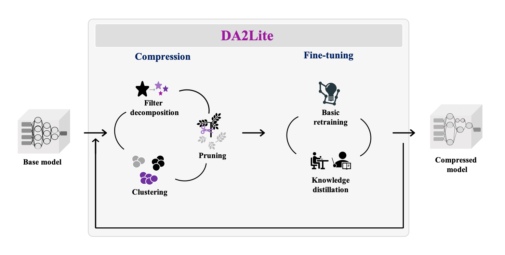

<p align="center">

</p>


**DA2Lite (Deep Architecture to Lite)** is a toolkit to compress and accelerate deep network models.

[](LICENSE)


:star: Star us on GitHub — it helps!!

<p align="center">

</p>


<table>
  <tbody>
    <tr align="center" valign="bottom">
    <td>
      </td>
      <td>
         
         <b>Frameworks & Libraries</b>
         
      </td>
      <td>
         
         <b>Algorithms</b>
         
      </td>
    </tr>
    </tr>
    <tr valign="top">
    <td align="center" valign="middle">
    <b>Built-in</b>
      </td>
      <td>
      <ul>
         <li><b>Supported Framework</b></li>
            <ul>
               <li>PyTorch</li>
            </ul>
      </ul>
      <ul>
        <li><b>Examples</b></li>
            <ul>
            <li><a href='https://github.com/da2so/DA2Lite/tree/main/examples/cifar10/resnet18_tucker'>resnet18_tucker</a></li>
            </ul>
      </ul>
      </td>
      <td align="left" >
         <ul>
            <li><b>Pruning</b></li>
            <ul>
               <li><a href='https://arxiv.org/abs/1608.08710'>L1 norm pruning</a></li>
               <li><a href='https://arxiv.org/abs/1608.08710'>L2 norm pruning</a></li>
               <li><a href='https://arxiv.org/abs/2007.02491'>EagleEye</a></li>
               <li><a href='https://arxiv.org/abs/1708.06519'>Slimming</a></li>
            </ul>
            <li><b>Filter Decomposition</b></li>
            <ul>
               <li><a href='https://arxiv.org/abs/1412.6553'>CP decomposition</a></li>
               <li><a href='https://arxiv.org/abs/1511.06530'>Tucker decomposition</a></li>
               <li><a href='https://www.jmlr.org/papers/volume14/nakajima13a/nakajima13a.pdf'>VBMF for rank selection</a></li>
            </ul>
            <li><b>Knowledge Distillation</b></li>
            <ul>
               <li><a href='https://arxiv.org/abs/1812.01839'>FSKD</a></li>
            </ul>
         </ul>
      </td>
    </tr>
  </tbody>
</table>


## Install

   ```shell
   git clone https://github.com/da2so/DA2Lite.git
   ```

You will need a machine with a GPU and CUDA installed.  
Then, you prepare runtime environment:

   ```shell
   pip install -r requirements.txt
   ```

## Use


### Run

`main.py`(**DA2Lite**) runs with two main configurations like as follows:

   ```shell
   CUDA_VISIBLE_DEVICES=0 python main.py --train_config_file=./configs/train/cifar10/cifar10/vgg16.yaml --compress_config_file=./configs/compress/tucker.yaml
   ```

The first one is `train_config_file`, which indicates training configurations and the other is `compress_config_file`, which represents compress configurations.
The details of available configurations are described in [Here](configs).

After you run **DA2Lite** to compress a DNN model, logging and compressed model are saved in `./log` directory.

The following shows the format of saving:
- YYYY-MM-DD.HH.MM.SS : format of saved directory for an instance.
   - models
      - origin_{dataset}_{model}.pt : The original model is saved.
      - compress_1_{dataset}_{model}.pt : The first compressed model is saved.
      - ...
   - process.log : The inevitable log is only logged.
   - specific_process.log : The training procedure log is added with process.log


### Example 

- Run the CIFAR10 example with resnet18 using tucker decomposition.
   - The pretrained-model are decomposed and right after fine-tuned: [Here](examples/cifar10/resnet18_tucker/README.md)


### Result

#### Cifar10 dataset

|Model|Acc(%)|Param num(M)|MACs(G)|File size(MB)|Download|
|-----|------|------------|-------|-------------|--------|
|ResNet18|94.74 -> 94.14 (-0.6) |11.17 -> 0.75 (14.81x)|0.56 -> 0.19 (2.96x)|42.70 -> 2.96 (14.44x)|[C_resnet18](https://drive.google.com/file/d/1YlzYwUKD30N3yUqjUQ2dgSUOGolUKrTd/view?usp=sharing)|


### TODO

* [ ] Multi-GPU training
* [ ] PyTorchMobile conversion
* [ ] Train a model based on a custom dataset
* [ ] Rand-augmentation for improving an accuracy
* [x] Make a model zoo
* [ ] Up-to-date model architectures.
* [ ] Train a model for object detection tasks (further future...)
* [ ] Compression methods for object detection tasks (further future...)

## License

The entire codebase is under [MIT license](LICENSE)

