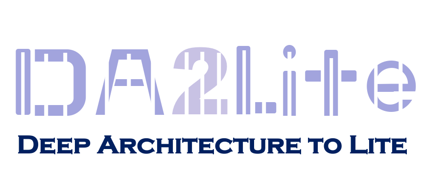

<p align="center">

</p>


**DA2Lite (Deep Architecture to Lite)** is a toolkit to compress and accelerate deep network models.

[](LICENSE)


:star: Star us on GitHub — it helps!!


## Install


   ```shell
   git clone https://github.com/da2so/DA2Lite.git
   ```

You will need a machine with a GPU and CUDA installed.  
Then, you prepare runtime environment:

   ```shell
   pip install -r requirements.txt
   ```

## Use